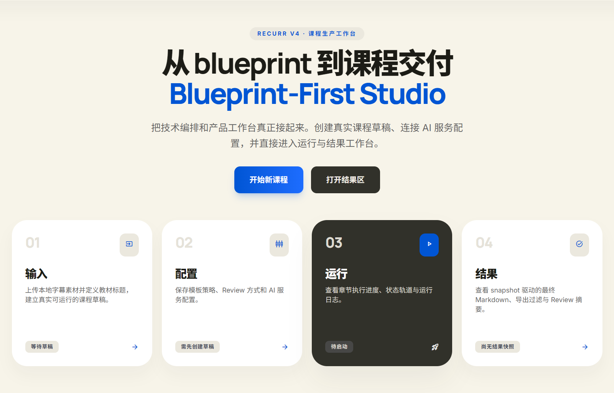

# ReCurr

`ReCurr` 是一个面向“出版教材 + 课程字幕/转写”的知识库生成系统。

它把原始 transcript 整理成可复用的课程级学习材料，而不是只做一次性摘要。当前项目同时提供：

- 一个稳定的 `CLI` 流水线入口
- 一个本地优先的 `Web GUI` 工作台
- 一套可恢复、可审计的课程级运行时合同

## GUI Preview



## 它解决什么问题

当你手上有一本教材和对应课程的字幕/转写时，整理出结构化学习资料往往很耗时，而且结果难以复用、难以继续补充、也难以追踪生成过程。

`ReCurr` 试图把这件事做成可执行系统：

- 先建立课程蓝图，而不是直接把所有内容塞进一个 prompt
- 再按章节和阶段运行流水线
- 产出可检查、可恢复、可导出的课程资料

## 你最终会得到什么

当前版本会围绕章节与课程级别生成这些内容：

- 章节精讲
- 术语与定义
- 面试问答
- 跨章关联
- 疑点与待核项
- 全局术语表
- 全局面试索引
- 结果预览与 ZIP 导出

这些产物适合继续整理成教辅材料，或导入 NotebookLM 一类学习工具。

## 当前已经实现的能力

- `course_blueprint.json` 驱动的课程级运行时
- `runtime_state.json` 驱动的 checkpoint / resume 语义
- transcript -> 中间 JSON -> 最终知识包 的多阶段流水线
- `build-blueprint` / `run-course` / `resume-course` / `build-global` / `clean-course` / `show-status`
- 本地优先的 GUI v1：输入、配置、运行、结果四页主流程
- GUI 已接通真实字幕文件上传、`LocalProcessRunner`、`SSE` 状态流、结果预览与 ZIP 导出
- 多后端模型接入：
  - `openai`
  - `openai_compatible`
  - `anthropic`
  - `heuristic`
  - `stub`
- 最小 `GitHub Actions CI`

## Quick Start

### GUI：本地一键联调

在仓库根目录启动前后端开发服务：

```powershell
.\start-gui-local.ps1
```

常见可选参数：

```powershell
.\start-gui-local.ps1 `
  -BackendPort 8100 `
  -FrontendPort 3100 `
  -SkipBackendInstall `
  -SkipFrontendInstall
```

脚本会：

- 清理目标端口上的旧进程
- 启动 `FastAPI` 后端与 `Next.js` 前端开发服务器
- 把日志写到 `out/_gui/`
- 对后端与前端页面做探活检查
- 保留当前 `PowerShell` 窗口作为控制窗口
- 隐藏后端与前端子进程窗口
- 在关闭控制窗口或按 `Ctrl+C` 时自动回收两个子进程

默认入口：

- 前端：`http://127.0.0.1:3000/courses/new/input`
- 后端：`http://127.0.0.1:8000/healthz`

### CLI：最小跑通路径

1. 复制配置模板

```powershell
Copy-Item .env.example .env
```

2. 先生成课程 blueprint

```powershell
python -m processagent.cli build-blueprint `
  --book-title "数据库系统概论" `
  --input-dir .\captions `
  --output-dir .\out `
  --toc-file .\toc.txt
```

3. 再运行整套课程流水线

```powershell
python -m processagent.cli run-course `
  --book-title "数据库系统概论" `
  --input-dir .\captions `
  --output-dir .\out `
  --toc-file .\toc.txt `
  --backend openai_compatible
```

## 项目结构

- [`processagent/`](processagent): blueprint、pipeline、CLI、prompt
- [`server/`](server): FastAPI GUI 编排 API、运行 adapter、产品模型
- [`web/`](web): Next.js GUI 前端
- [`tests/`](tests): `unittest` 回归测试
- [`docs/`](docs): roadmap、架构、schema、runbook、决策
- [`out/`](out): 运行时产物，不作为 repo source of truth

## 当前边界与限制


- 当前主输入仍以字幕/转写文本为主，多模态教材材料还未接入正式 runtime
- 同一门课程当前只允许一个活跃 run，避免并发写坏同一份课程产物
- GUI 当前是本地优先工作流，不是云端多租户产品
- 部分产品层配置还没有完全进入 `run-course` 的 runtime contract

## 文档入口

- [`docs/README.md`](docs/README.md): 文档系统总览
- [`docs/roadmap.md`](docs/roadmap.md): 阶段规划与后续方向
- [`docs/architecture/blueprint-first.md`](docs/architecture/blueprint-first.md): blueprint-first 架构
- [`docs/architecture/runtime-layout.md`](docs/architecture/runtime-layout.md): runtime 布局与 checkpoint 规则
- [`docs/runbooks/run-course.md`](docs/runbooks/run-course.md): CLI / run / resume / clean / status 合同
- [`docs/runbooks/gui-dev.md`](docs/runbooks/gui-dev.md): GUI 本地开发、验证与行为说明
- [`docs/schemas/course_blueprint.md`](docs/schemas/course_blueprint.md): blueprint schema
- [`AGENTS.md`](AGENTS.md): 仓库级协作与操作索引

## 本地验证

```powershell
python -m unittest discover -s tests -v
```

`GitHub Actions CI` 当前也使用同一条命令做最小校验。
